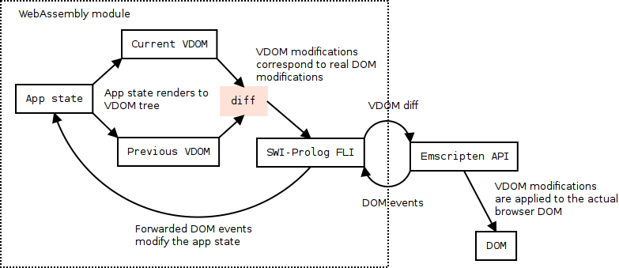

# Prolog Virtual DOM

This is a Virtual DOM implementation for Prolog. It is
designed to be used with the WebAssembly build of SWI-Prolog.

The implementation keeps the VDOM tree on the Prolog side
and serializes the initial tree and modifications through
the foreign language interface.

Demo: <http://demos.rlaanemets.com/prolog-vdom/examples/wasm/>

## Overview



## Prolog API

See example:

```prolog
VIn = div([], [hello]),
VPrev = div([], [world]),
vdom_diff(VIn, VPrev, Diff, VOut).
```

 * VIn - current VDOM tree.
 * VPrev - previous VDOM tree.
 * Diff - serialized updates (`diff(replace(path(0), "hello"))`).
 * VOut - current full VDOM tree.

In this example the first child of the root node is being
replaced by the text node containing "hello".

### VDOM nodes

VDOM nodes are either atomic terms or tags. Atomic terms are atoms,
numbers and strings.

Tags have the general form of `name(Attributes, Body)` and they
correspond to real DOM tags unless there is a component registered
with the same name.

### Components

VDOM components are both an abstraction and optimization tool.
Components are registered using the `vdom_component_register(Name, Pred)`
predicate. Name refers to the component's name and Pred refers
to the component's rendering predicate.

Components with the same input data at the corresponding VDOM node are
not re-rendered during the diff calculation. This allows to skip
major parts of the VDOM tree in the algorithm.

### Keyed node

Keyed node is a VDOM node where children have distinct `key`
attributes. This is a common case where a list is rendered into
a list of VDOM nodes. The VDOM diff algorithm is able to:

 * Reorder children effectively.
 * Add/remove new children in/from the middle.

for a keyed node.

## JavaScript (in-page) API

The JavaScript part consist of the following code:

 * File `js/prolog.js` - Prolog FLI bound using Emscripten.
 * File `js/patcher.js` - Helper that applies patches onto the real DOM and forwards DOM events.

Construct a new Prolog FLI instance:

```js
const prolog = new Prolog(module, args);
```

where `module` is a Emscripten [module object][Module] and
`args` is an array or arguments for [PL_initialise][pl-init] function.

With the semi-official SWI-Prolog WebAssembly [build][swi-wasm], `args` is:

```js
[
    'swipl',
    '-x', 'wasm-preload/swipl.prc',
    '--nosignals'
]
```

[Module]:https://kripken.github.io/emscripten-site/docs/api_reference/module.html
[pl-init]:http://www.swi-prolog.org/pldoc/doc_for?object=c(%27PL_initialise%27)
[swi-wasm]:https://github.com/SWI-Prolog/swipl-wasm

Construct a new Patcher instance:

```js
const patcher = new Patcher(prolog, root);
```

where `prolog` is a Prolog instance and `root` is the
application's root DOM element (it does not have to be `document.body`).

## DOM serialization

Atomic terms are serialized as strings.

Attribute terms:

```prolog
attrs(name1(Value1), name2(Value2))
```

where Value1 and Value2 are strings.

Tags:

```prolog
name(Attrs, body(Child1, Child2)).
```

where Attrs is an attribute term and Child1 and
Child2 are serialized DOM subtrees.

## DOM patch serialization

Node rebuild:

```prolog
replace(Path, Dom)
```

where Path is a path term and Dom is a serialized DOM
tree as described in "DOM serialization".

Set/unset attributes:

```prolog
set_attrs(Path, Attrs)
```

where Path is a path term and Attrs an attributes term.

Reorder-or-create:

```prolog
roc(Path, actions(Action1, Action2))
```

where Path is a path term and Action1 and Action2 are
terms in the form:

Reuse term (reuses DOM node from the old index):

```prolog
reuse(Index)
```

Create term (creates a new DOM node):

```prolog
create(Dom)
```

where Dom is a serialized DOM tree for the node as
described in "DOM serialization".

Path term:

```prolog
path(0, 2)
```

Path term represents path from the root element down to
the element that is being modified. For example, `path(0, 2)`
refers to 1st child of the root, and 3rd subchild of the child.

## TODO

 * Style updates.
 * Special `each` node.

## License

The MIT license. See the LICENSE file.
